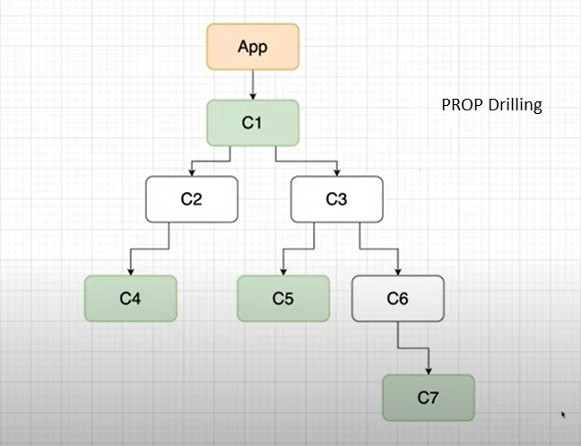
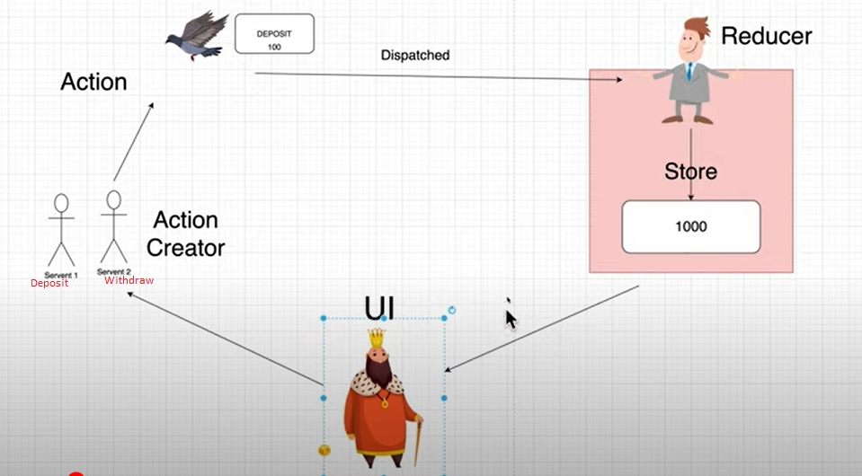
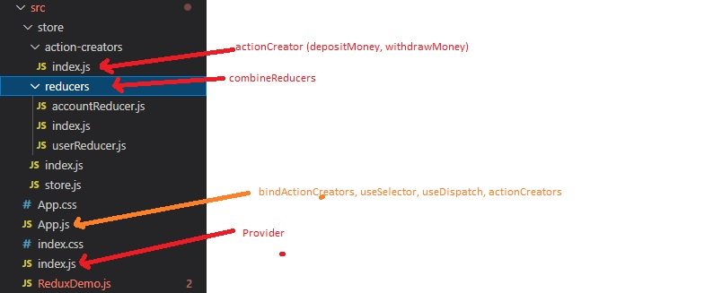

#### React Redux
Reference [https://www.youtube.com/watch?v=9jULHSe41ls]

##### Principles of Redux
* Single source of truth
* State is read only
* Changes are made with pure function

##### 4 Steps in Redux
* Store (has two piece of information - Reducer and State of the application)
* Reducer (has current State and Action to be performed based on State)
* Subscribe (subscribe to the base where base is the State of the application)
* Dispatch (commands to invoke methods)

##### Now, create react app

```
$ npx create-react-app .
$ npm install --save redux
```

##### A Simple React Redux Demo

```javascript
import React from 'react';
import { createStore } from 'redux';

const ReduxDemo = () => {
    // Step 2 - Reducer -> state and action
    const reducer = (state, action) => {
        if(action.type === "Fetch"){
            return action.payload;
        }
        // state is necessary. pass default state if there is null or undefined values
        return state; 
    }
    // Step 1 - Store -> reducer and state
    const store = createStore(reducer, "Basket");
    // Step 3 - Subscribe (callback) to the store to get state
    store.subscribe(() => {
        console.log("Store state is now -> " + store.getState())
    });
    // Step 4 - Dispatch the action
    store.dispatch({type: "Fetch", payload: "Fruits"});

  return (<div>
      Redux Demo
  </div>);
};
export default ReduxDemo;
```

##### Props Drilling
Every single component will need to pass the state to every other component in the path even if they don't need it. Redux helps in this scenario by having an isolated store and centralizing it for its access across the components



Some of the terminologies used in Redux
* Reducer
* Action
* Action Creator (creates Action that gets dispatched to Reducer)
* Action Type
* Action Payload
* Dispatch
* Store





```
$ npm install react-redux
$ mkdir src/store
$ mkdir src/store/reducers
$ cd src/store/reducers
$ touch accountReducer.js
$ touch index.js
$ touch src/store/store.js

// to handle async functions
$ npm install redux-thunk
```



Create the reducers (accountReducer.js)
Combine multiple reducers into the store (index.js)
Create the store
Create the provider